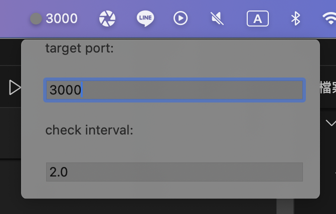

# Port Pulse

Port Pulse is a mac menu bar app built using SwiftUI that monitors the status of a specified network port.




## Table of Contents

- [Port Pulse](#port-pulse)
  - [Table of Contents](#table-of-contents)
  - [Project Motivation](#project-motivation)
    - [The Battery Drainage Dilemma](#the-battery-drainage-dilemma)
    - [A Simple Solution for a Common Problem](#a-simple-solution-for-a-common-problem)
    - [Key Features](#key-features)
    - [Contribute to Efficiency](#contribute-to-efficiency)
  - [Features](#features)
  - [Requirements](#requirements)
  - [Getting Started](#getting-started)
  - [Usage](#usage)
    - [Check Port Status](#check-port-status)
    - [Start Monitoring](#start-monitoring)
    - [Stop Monitoring](#stop-monitoring)
    - [Adjust Target Port](#adjust-target-port)
    - [Adjust Monitoring Interval](#adjust-monitoring-interval)
  - [Contributing](#contributing)
  - [License](#license)

## Project Motivation

In the dynamic world of web development, it's not uncommon to find ourselves constantly spinning up local servers for testing and development. While this practice is essential for creating and refining our applications, it often comes with a common pitfall – the inadvertent neglect of shutting down these local servers.

### The Battery Drainage Dilemma

For developers who work on-the-go or rely on laptops, the oversight of leaving local servers running can lead to an unexpected drain on precious battery life. Unintentionally consuming system resources and power, these lingering processes can have a significant impact on the overall efficiency and longevity of our devices.

### A Simple Solution for a Common Problem

Our project aims to address this common issue by providing a straightforward and user-friendly tool. By offering an intuitive interface to manage and monitor local servers, developers can ensure that resources are utilized judiciously, preventing unnecessary battery drainage.

### Key Features

- **Port Status Monitoring:** Easily check the status of specified ports.
- **Continuous Monitoring:** Initiate and stop continuous monitoring of ports.
- **User-Defined Port:** Adjust the target port effortlessly.
- **Monitoring Interval Control:** Fine-tune the monitoring interval based on your preferences.

### Contribute to Efficiency

This project is not just a tool; it's a mindset. By adopting this application into your workflow, you contribute to a more efficient and sustainable development environment. Say goodbye to the unintentional drain on your laptop's battery, and hello to a more mindful and resource-conscious development practice.

**Join us on this journey to make web development not only powerful but also environmentally friendly!**

## Features

- **Real-time Monitoring:** Constantly checks the status of the specified port.
- **User Interaction:** Easily check and manage the port status through the macOS menu bar or the application window.
- **Customizable:** Adjust the target port and monitoring interval to suit your needs.

## Requirements

- macOS 10.15 or later

## Getting Started

1. Clone the repository:

```bash
git clone https://github.com/your-username/port-pulse.git
cd port-pulse
```

1. Open the project in Xcode.

2. Build and run the project.

3. Use the application to check and monitor the status of the specified network port.

## Usage

### Check Port Status

- Click the "Check Port" button in the application window to manually check the status of the specified port.

### Start Monitoring

- Click the "Start Monitoring" button to initiate continuous monitoring of the port.

### Stop Monitoring

- Click the "Stop Monitoring" button to halt continuous monitoring.

### Adjust Target Port

- Use the "target port" section in the application window to input the desired port.

### Adjust Monitoring Interval

- Use the "check interval" section in the application window to adjust the monitoring interval.

## Contributing

If you have suggestions, improvements, or find issues, feel free to open an issue or create a pull request.

## License

This project is licensed under the MIT License.
